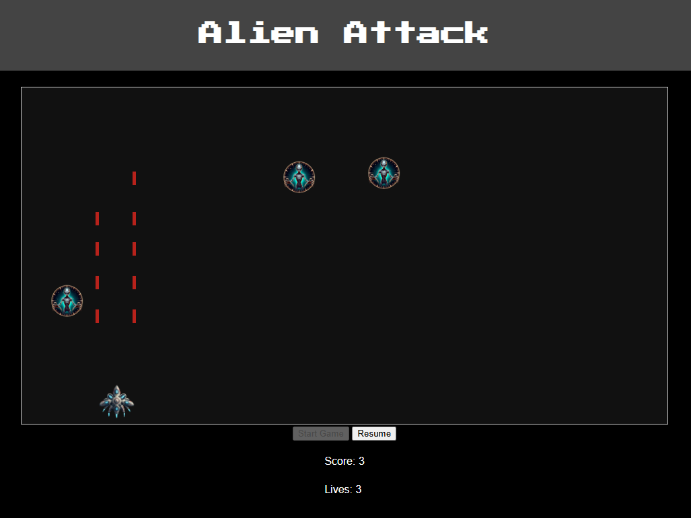
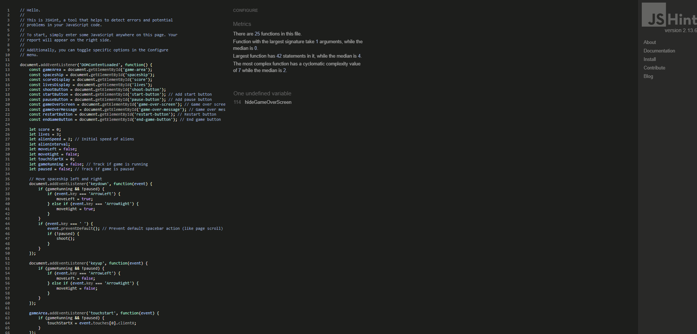

## Purpose
This web application is a simple space shooter game where the player controls a spaceship, shoots at incoming aliens, and tries to get the highest score possible before losing all lives. It is optimized for both desktop and touchscreen devices.

## Index – Table of Contents
* [User Experience (UX)](#user-experience-ux)
* [Target Audience](#target-audience) 
* [Features](#features)
* [Design](#design)
* [Technologies Used](#technologies-used)
* [Testing](#testing)
* [Deployment](#deployment)
* [Credits](#credits)

## User Experience (UX)

The Space Invaders game is designed to provide an intuitive and enjoyable experience across various devices:

#### Responsive Design:

- Adaptable layout for desktop, tablet, and mobile devices using CSS media queries.

#### Intuitive Controls:

- Desktop: Control the spaceship with arrow keys and shoot with the space bar.
- Mobile/Tablet: Swipe to move and tap the "Shoot" button.

#### Accessibility:

- High contrast colors and alt text for images to support users with visual impairments.

#### Visual Feedback:

- Immediate feedback for actions like shooting and collisions.
- Real-time updates to score and lives.

#### Structured Layout:

- Centralized game area with clear boundaries.
- Visible score and lives indicators.

#### Consistent Styling:

- Uniform style and color scheme for all game elements.
- Cohesive design for background and UI elements.

#### Performance:

- Optimized for smooth animations and interactions on all devices.

These UX considerations ensure a smooth, accessible, and engaging experience for all users.

## Target Audience

The target audience for this game includes:

- **Nostalgic Gamers**: Individuals who fondly remember classic Atari games and enjoy retro gaming experiences.
  
- **Casual Gamers**: People looking for a simple yet engaging game to play during short breaks or leisure time.
  
- **All Ages**: Suitable for both young and old gamers who appreciate timeless gameplay mechanics and straightforward controls.
  
- **Arcade Enthusiasts**: Fans of arcade-style games who enjoy challenging their reflexes and aiming for high scores.

This game aims to bring back the charm and simplicity of early video games, offering an immersive yet accessible experience reminiscent of the Atari era.

## Features
- Moving spaceship controlled by arrow keys or touch gestures
- Shooting projectiles with spacebar
- Randomly appearing aliens that move down the screen
- Score counter that increments with each alien destroyed
- Increasing difficulty as the score increases
- Lives counter that decrements when aliens reach the bottom of the screen

## Design

#### Layout:

- Central Game Area: Focused gameplay area with visible score and lives display.

#### Visual Elements:

- Spaceship and Aliens: Distinct, animated sprites for clarity and engagement.
- Projectiles: Bright colors for easy visibility.

#### Styling:

- Consistent Color Scheme: High contrast for better readability.
- CSS Transitions: Smooth movements for enhanced experience.
- Responsive Design: Adapts to various screen sizes using media queries.

#### Accessibility:

- High Contrast Colors: Improves visibility for all users.
- Alt Text for Images: Supports screen readers.

#### Interactivity:

- Keyboard and Touch Controls: Intuitive controls for desktop and mobile users.

## Performance Optimization:

- Efficient Asset Management: Fast loading and smooth gameplay.
- Minimized Lag: Optimized code for responsive interactions.

## Technologies Used

### Languages Used

-   [HTML5](https://en.wikipedia.org/wiki/HTML5)
-   [CSS3](https://en.wikipedia.org/wiki/Cascading_Style_Sheets)
-   [JavaScript](https://en.wikipedia.org/wiki/JavaScript)

### Frameworks, Libraries & Programs Used

-   [Google Fonts:](https://fonts.google.com/) was used to import the 'Press Start 2P' font into the style.css file which is used on header of the project.
-   [Git:](https://codeinstitute-ide.net/) was used for version control by utilising the Gitpod terminal to commit to Git and Push to GitHub.
-   [GitHub:](https://github.com/) is used as the respository for the projects code after being pushed from Git.

## Testing

### Validator Testing

- [HTML Validator](https://validator.w3.org/)

    - result for index.html
      

 - [CSS Validator](https://jigsaw.w3.org/css-validator/)

    - result for styles.css 
          

- [JavaScript Code Analysis](https://jshint.com/)

    - result for script.js
         

### Google lighthouse testing

### index.html 

### Bugs 

#### Fixed Bugs

- Spaceship moves partially out of view on left-hand side of the game area

#### Unfixed Bugs

- Shoot button appearing over footer on mobile screens

## Deployment

> To deploy the project I followed these steps starting from the main project repository [here](https://github.com/dmuresanu/Project-2).

 1. Clicked on `Settings` on the navigation menu in the repository
 2. I then selected the `Pages` menu on the side bar.
 3. In the first dropdown menu labeled `Source` I selected the branch of the name `main` from the dropdown.
 4. In the next dropdown labeled `/root` I left as the default option.
 5. Selected Save
 
> I then received a notification from GitHub that my project is being deployed and after about 1 minute & a couple of refreshes of the page it was ready and live.

## Credits

### Code

Code was written by using references from [W3Schools](https://www.w3schools.com/)

### Media 
- Spaceship image generated with [MicrosoftDesigner] (https://designer.microsoft.com/image-creator)
- Alien image generated with [MicrosoftDesigner] (https://designer.microsoft.com/image-creator)
- Favicon created with [IONOS] (https://www.ionos.com/tools/favicon-generator#tool)

### Acknowledgments

- Thank you to my mentor Alan Bushell who gave me very good advice and feedback on how to plan and execute this project.

